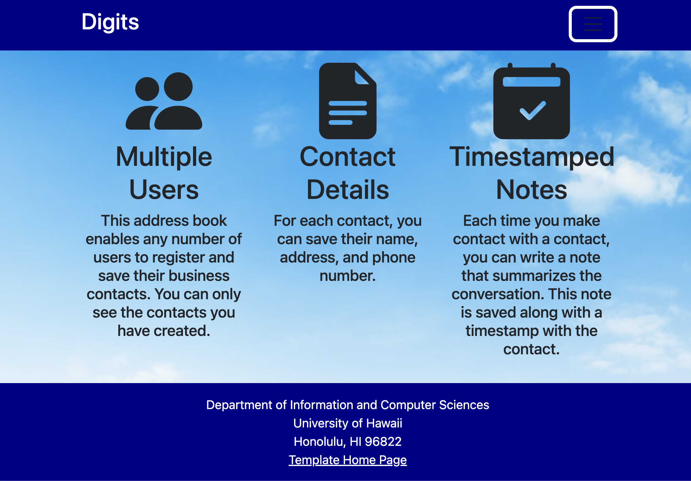
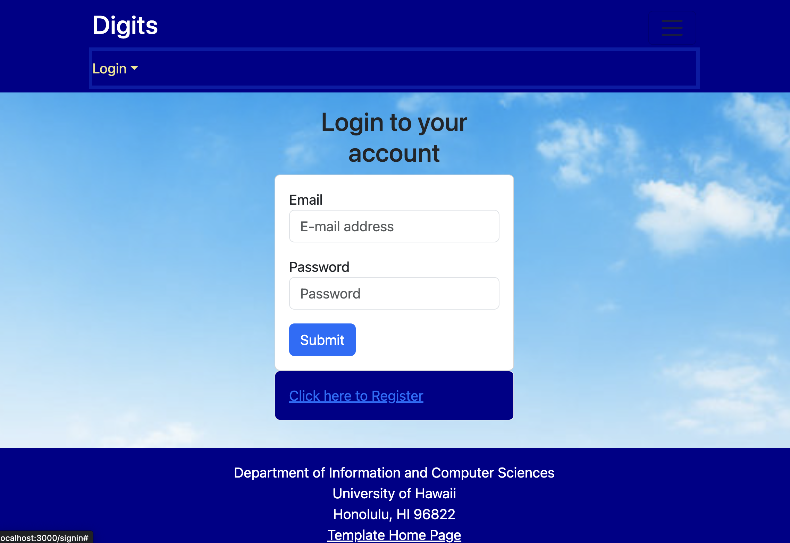
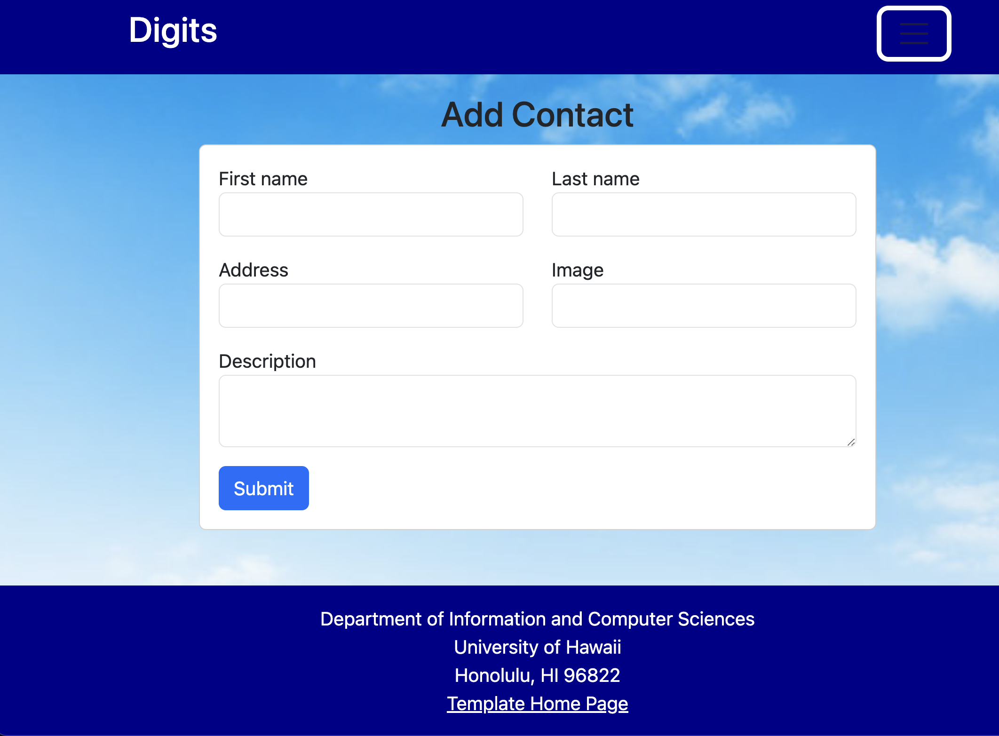
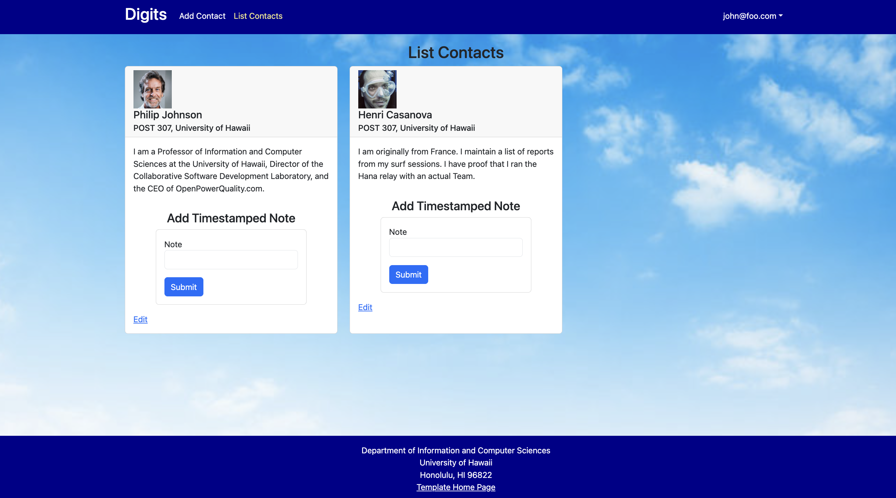
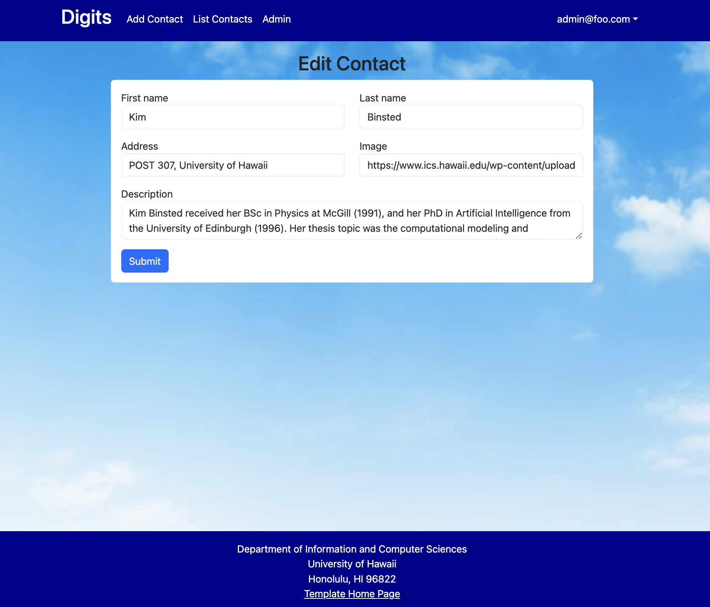
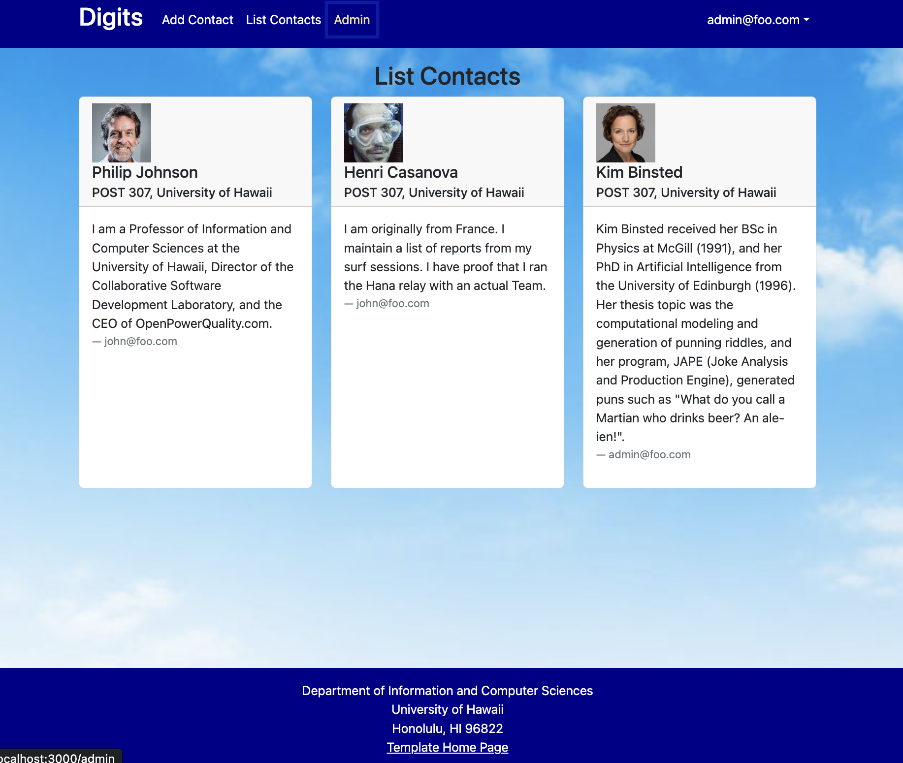

<h1>Digits-Semantic-UI</h1>

Digits is an application that allows users to:
* Register an account
* Create and manage a set of contacts
* Add a set of timestamped notes regarding tehir interaction with each contact.

## Installation

First, [install Meteor](https://www.meteor.com/install).

Second, go to [https://github.com/ics-software-engineering/meteor-application-template-react](https://github.com/ics-software-engineering/meteor-application-template-react), and click the "Use this template" button. Complete the dialog box to create a new repository that you own that is initialized with this template's files.

Third, go to your newly created repository, and click the "Clone or download" button to download your new GitHub repo to your local file system.  Using [GitHub Desktop](https://desktop.github.com/) is a great choice if you use MacOS or Windows.

Fourth, cd into the app/ directory of your local copy of the repo, and install third party libraries with:

```
$ meteor npm install
```

## Running the system

Once the libraries are installed, you can run the application by invoking the "start" script in the [package.json file](https://github.com/ics-software-engineering/meteor-application-template-react/blob/master/app/package.json):

```
$ meteor npm run start
```

The first time you run the app, it will create some default users and data. Here is the output:

```
 meteor npm run start 

> meteor-application-template-react@ start /Users/carletonmoore/GitHub/ICS314/meteor-application-template-react/app
> meteor --no-release-check --exclude-archs web.browser.legacy,web.cordova --settings ../config/settings.development.json

[[[[[ ~/GitHub/ICS314/meteor-application-template-react/app ]]]]]

=> Started proxy.                             
=> Started HMR server.                        
=> Started MongoDB.                           
I20220529-12:09:18.384(-10)? Creating the default user(s)
I20220529-12:09:18.389(-10)?   Creating user admin@foo.com.
I20220529-12:09:18.453(-10)?   Creating user john@foo.com.
I20231106-16:25:29.572(-10)? Creating default contacts.
I20231106-16:25:29.572(-10)?   Adding: Johnson (john@foo.com)
I20231106-16:25:29.592(-10)?   Adding: Casanova (john@foo.com)
I20231106-16:25:29.593(-10)?   Adding: Binsted (admin@foo.com)
=> Started your app.

=> App running at: http://localhost:3000/
```

Periodically, you might see `Error starting Mongo (2 tries left): Cannot run replSetReconfig because the node is currently updating its configuration` after the `=> Started HMR server.`. It doesn't seem to be a problem since the MongoDB does start.

### Viewing the running app

If all goes well, the template application will appear at [http://localhost:3000](http://localhost:3000).  You can login using the credentials in [settings.development.json](https://github.com/ics-software-engineering/meteor-application-template-react/blob/main/config/settings.development.json), or else register a new account.

### ESLint

You can verify that the code obeys our coding standards by running ESLint over the code in the imports/ directory with:

```
meteor npm run lint
```

## Walkthrough

The following sections describe the major features of this template.

### Directory structure

The top-level directory structure is:

```
.github     # holds the GitHub Continuous Integration action and Issue template.
app/        # holds the Meteor application sources
config/     # holds configuration files, such as settings.development.json
doc/        # holds developer documentation, user guides, etc.
.gitignore  # don't commit IntelliJ project files, node_modules, and settings.production.json
```

This structure separates documentation files (such as screenshots) and configuration files (such as the settings files) from the actual Meteor application.

The app/ directory has this structure:

```
.deploy/
  .gitignore     # don't commit mup.js or settings.json
  mup.sample.js  # sample mup.js file used for deploying the application
  settings.sample.json # sample settings file
  
client/
  main.html      # The boilerplate HTML with a "root" div to be manipulated by React.
  main.js        # import startup files.

imports/
  api/           # Define collections
    stuff/       # The Stuffs collection definition
  startup/       # Define code to run when system starts up (client-only, server-only, both)
    client/
    server/
  ui/
    components/  # Contains page elements, some of which could appear on multiple pages.
    layouts/     # Contains top-level layout (<App> component).
    pages/       # Contains components for each page.

node_modules/    # managed by npm

public/          # static assets (like images) can go here.

server/
   main.js       # import the server-side js files.
   
tests/           # testcafe acceptance tests.
```

<h2>User Interface Walkthrough</h2>

#### Landing page

When you retrieve the app at http://localhost:3000, this is what should be displayed:


The next step is to use the Login menu to either Login to an existing account or register a new account.

#### Login page

Clicking on the Login link, then on the Sign In menu item displays this page:




#### Add Contact page

After logging in, here is the page that allows you to add new contacts:



#### List Stuff page

After logging in, here is the page that allows you to list all the contacts you have created:



You click the "Edit" link to go to the Edit contacts page, shown next.

#### Edit Stuff page

After clicking on the "Edit" link associated with an item, this page displays that allows you to change and save it:



#### Landing (after Login), Admin user

You can define an "admin" user in the settings.json file. This user, after logging in, gets a special entry in the navbar:

